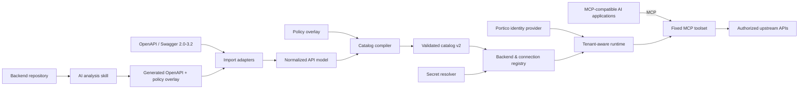
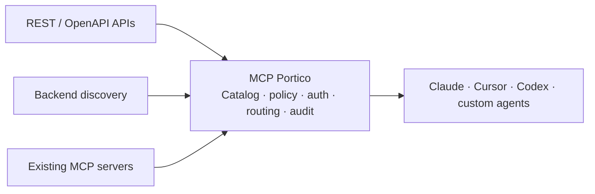
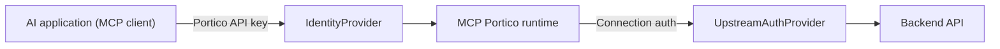

# MCP Portico

**The MCP front door for your entire API estate.**

[](https://github.com/yashcodelabs/mcp-portico/actions/workflows/ci.yml)
[](LICENSE)
[](package.json)

Bring REST/OpenAPI APIs, internally discovered APIs, and existing MCP servers
together behind one governed MCP endpoint. Claude, Cursor, Codex, and custom
agents connect once through MCP Portico while it handles discovery,
authentication, policy, tenant isolation, routing, and audit.

**No backend rewrite required. No per-client integration required.**

```text
REST / OpenAPI APIs ───────┐
Backend-discovered APIs ──┼──> MCP Portico ──> Claude / Cursor / Codex
Existing MCP servers ─────┘                         / custom agents
```

MCP Portico gives the APIs you already have an MCP interface. It turns an
organization's existing backend estate into governed, discoverable tools for
AI applications without requiring every backend team to build and maintain a
separate MCP server.

MCP Portico is not tied to a particular model, vendor, agent framework, or
user-interface type: any application that speaks MCP can connect. It does
not own or provision the model, the agent, or the upstream identity
provider; it secures the boundary between them and your internal systems.

> **Status:** `0.1.0` early public preview. The core gateway, catalog compiler,
> tenant registry, MCP runtime, security boundaries, examples, and release
> packaging are in place. The project is looking for feedback from developers
> and platform teams evaluating MCP access to internal APIs. This repository is
> a fresh implementation following the
> [implementation plan](https://github.com/yashcodelabs/mcp-portico/blob/main/docs/mcp-portico-implementation-plan.md).

**Roadmap:** The [client-neutral MCP roadmap](https://github.com/yashcodelabs/mcp-portico/blob/main/docs/roadmap.md)
tracks the evolution from a v1 HTTP API gateway to a client-neutral access
layer for any MCP-compatible AI application.

## The API-estate problem

Most organizations have a mix of REST services, OpenAPI descriptions, legacy
internal systems, and a growing number of MCP servers. Connecting each system
to each AI client creates duplicated integrations, inconsistent policy, and
credentials spread across clients.

```text
Without Portico:

Orders API ───────> custom MCP integration ───────> AI client 1
CRM API ──────────> custom MCP integration ───────> AI client 2
Legacy service ───> custom MCP integration ───────> AI client 3
```

## The Portico approach

Portico provides one MCP boundary for the entire API estate:

```text
OpenAPI / Swagger ───────┐
Backend discovery ───────┼──> Catalog + policy ──> MCP Portico ──> Any MCP client
Existing MCP servers ────┘             │
                                       └── auth · tenants · routing · audit
```

This gives platform teams:

- **One integration point** for Claude, Cursor, Codex, and custom agents.
- **One policy boundary** for discovery, authorization, approvals, and audit.
- **One catalog model** for APIs that already speak MCP and APIs that do not.
- **Server-side credentials** so AI clients never receive unrestricted backend
  access.

## Why MCP Portico

- **One MCP front door, many backends** - expose REST/OpenAPI APIs,
  self-discovered internal APIs, and native MCP servers through one consistent
  MCP boundary.
- **No backend rewrite required** - compile existing API descriptions or
  inspected backend metadata into governed MCP tools.
- **Any MCP client, one connection** - coding assistants, support agents,
  workflow agents, BI agents, voice agents, and custom applications all speak
  the same MCP protocol and use the same fixed toolset. No vendor, model, or
  agent framework is required.
- **The catalog is the gate** - operations are compiled from OpenAPI/Swagger
  or AI-analyzed backend metadata into a validated catalog. Only
  catalog-gated operations can run, keyed by stable operation ID.
- **One deployment, many backends** - a backend registry and tenant-scoped
  connections isolate URLs, credentials, and policies.
- **A fixed MCP toolset** - discovery, description, and gated execution
  instead of arbitrary method/path input.
- **An operator CLI** - catalog import/validate/diff, registry validation,
  connection testing, and usage analysis.

## CTO view: one governed AI access layer

MCP Portico is useful when a company wants many AI experiences to work with
its existing API estate without building a separate security and integration
layer for every product or backend. Cursor, Claude Code, Codex, support
agents, workflow copilots, and custom applications can all use the same
Portico boundary.

```text
Many AI hosts
    │  one MCP contract
    ▼
MCP Portico
    │  identity · tenant policy · catalog gates · approvals · audit
    ▼
CRM · ERP · tickets · inventory · finance · observability · internal APIs
```

| Business scenario   | What an AI host can do                                         | CTO-level control                                           |
| ------------------- | -------------------------------------------------------------- | ----------------------------------------------------------- |
| Customer support    | Check orders, refunds, tickets, and delivery status            | Tenant isolation, redaction, approval-gated writes          |
| Finance operations  | Explain overdue invoices and prepare collection actions        | Backend credentials stay server-side; actions are auditable |
| Incident response   | Correlate alerts, deployments, logs, and service ownership     | Restricted tools, rate limits, environment boundaries       |
| Supply chain        | Join weather, inventory, carrier, and order data               | One policy boundary across multiple private systems         |
| Sales operations    | Summarize account health from CRM, usage, billing, and support | Account-scoped access and reusable integrations             |
| Security operations | Investigate alerts across IAM, SIEM, tickets, and assets       | Read-only defaults, sensitive-field controls, auditability  |
| Procurement         | Compare vendors, purchase orders, and contract limits          | Confirmation before creating or changing commitments        |

## CTO view: API-estate coverage

The strategic value is not only MCP transport. Portico gives an organization a
repeatable way to make its existing APIs available to AI without creating a
new integration project for every client or backend.

| Existing estate                          | Portico outcome                           | Operating benefit                                    |
| ---------------------------------------- | ----------------------------------------- | ---------------------------------------------------- |
| REST/OpenAPI services                    | Compiled MCP tools                        | No per-backend MCP rewrite                           |
| Legacy or undocumented internal APIs     | Backend-discovered catalog input          | Bring more of the estate into the same control plane |
| Existing MCP servers                     | Federated behind the same boundary        | Preserve existing investments                        |
| Claude, Cursor, Codex, and custom agents | One MCP connection                        | No per-client integration                            |
| Sensitive enterprise systems             | Tenant-aware, policy-controlled execution | Centralized security and audit                       |

The weather-aware fulfillment example is deliberately small, but the pattern
is enterprise-sized: the useful answer requires joining data from multiple
systems that no single public API can provide. The same model extends to CRM,
ERP, finance, support, observability, procurement, and internal operations.

### What the connected-host experience looks like

```text
You: Which open orders are at risk from tomorrow's weather?

Host: I found 2 elevated-risk orders:
      ORD-1001 in New York — 80% rain probability.
      ORD-1003 in Chicago — 70% rain probability and 48 km/h wind.
      Both have substitute inventory elsewhere.

You: What is the total order value exposed?

Host: $4,080 across 2 open orders.
```

The host decides which MCP tools to call. Portico authenticates the host,
enforces the tenant and catalog policy, and makes the authorized upstream HTTP
calls. The model never receives backend credentials or unrestricted method/path
access.

## Who should try it

- **AI and platform engineers** who want one MCP endpoint for several internal
  APIs without binding their application to a specific model vendor or agent
  framework.
- **Security and platform teams** who need tenant isolation, explicit operation
  policy, separate upstream credentials, SSRF protections, and auditable
  execution at the MCP boundary.
- **Developers building MCP clients** who want a deterministic compatibility
  contract and realistic multi-backend examples to test against.

MCP Portico is self-hosted infrastructure, not a hosted MCP marketplace. It is
intended to sit inside the security boundary of the team operating it.

## Architecture

MCP Portico is the security and policy boundary between AI applications and
internal systems: it authenticates the calling MCP client, resolves tenant
and connection context server-side, and enforces catalog and connection
policy on every operation. Backend credentials never reach the client.




The front-door flow can be summarized as:



## Authentication at two layers



The client credential identifies the calling application's principal and is
never reused as an upstream credential. Client authentication, tenant
selection, and upstream authentication are separate contracts; only the
operator-configured connection supplies the backend origin and credentials.
Secrets are stored as environment references, and nothing secret appears in
logs, telemetry, or MCP responses.

## Quick start

```bash
# Prerequisites: Node.js >= 22 and pnpm 11
pnpm install
pnpm build
pnpm cli --help
```

`mcp-portico --help` and `mcp-portico serve` are available after `pnpm build`.

For an end-to-end walkthrough, see the
[weather-aware fulfillment risk demo](examples/use-cases/weather-orders-inventory/README.md).
It joins a public weather API with deterministic private orders and inventory
backends through the same MCP boundary an enterprise deployment would use.

For a five-minute evaluation with no external services or manual setup, run:

```bash
pnpm install
pnpm demo
```

The command creates temporary credentials and registry state, starts
deterministic loopback weather, orders, and inventory APIs, runs the joined MCP
brief, prints a human-readable risk summary, and removes everything before it
exits.

When run in a terminal, it also offers example questions to choose from. Use
`mcp-portico demo --non-interactive` for a single pass in scripts or CI.

To use the demo from an existing AI host, keep it running and print a
ready-to-paste setup for Cursor, Claude Code, or Codex:

```bash
mcp-portico demo --connect cursor
mcp-portico demo --connect claude
mcp-portico demo --connect codex
```

The server stays alive while the host connects, then removes its temporary
registry, key, and local APIs when you press Enter to stop it.

Sample questions to ask from any connected host:

- Which open orders are at risk from tomorrow's weather?
- Which exposed orders have substitute inventory elsewhere?
- What is the total order value exposed to weather disruption?
- Compare the weather risk and fulfillment alternatives for New York, Boston,
  and Chicago.

Maintainers can run `pnpm ci:check` for the complete release gate.

## Install from npm

The `mcp-portico` package is prepared for a public release and ships the CLI,
JSON Schemas, public MCP compatibility contracts, and runnable examples. Once
the first release is published, install it with:

```bash
npm install -g mcp-portico
mcp-portico --help
```

The package builds a fresh `dist/` on pack, so the tarball never contains
stale build output.

The supported npm surface is the `mcp-portico` executable, published JSON
Schemas, and the accompanying documentation. The compiled internal modules are
not a stable TypeScript library API.

Version tags (`v*`) run the full release gate and publish through the
repository's npm trusted-publishing workflow.

## Interface

```text
mcp-portico serve --registry <registry-file>      # implemented
mcp-portico demo                                  # implemented
mcp-portico demo --connect <cursor|claude|codex>  # implemented
mcp-portico catalog import <openapi-file> --api-id <id> --output <catalog> --report <report>   # implemented
mcp-portico catalog import <ai-openapi> --api-id <id> --ai --overlay <overlay> --output <catalog> --report <report>   # implemented (AI-analysis artifacts)
mcp-portico catalog validate <catalog-file>       # implemented
mcp-portico catalog diff <old> <new>              # implemented
mcp-portico registry validate <registry-file>     # implemented
mcp-portico key create --registry <file> --tenant <id> --principal <id>   # implemented
mcp-portico connection test <connection-id> --registry <file>   # implemented
```

`serve` loads and validates the registry at startup (and reloads it atomically
when the file changes), enforcing secret resolution and destination security
policy before listening.

## Importing a catalog

`catalog import` compiles a Swagger 2.0 or OpenAPI 3.0-3.2 document (JSON or
YAML) into a validated, credential-free catalog and a structured report. It
never touches the registry.

```bash
mcp-portico catalog import ./petstore.yaml \
  --api-id petstore \
  --output ./catalogs/petstore-1.0.0.json \
  --report ./catalogs/petstore-1.0.0.report.json \
  --overlay ./petstore.overlay.json
```

External `$ref` documents are denied by default. To import them, permit
relative file refs (`--allow-file-refs`) and/or remote refs
(`--allow-remote-refs` with `--remote-host <host>`); remote refs are
https-only unless `--allow-http` is set, and private/loopback destinations
require `--allow-private-network`. The report records every dropped
unsupported feature (callbacks, links, webhooks, unsupported content types,
unsupported security schemes) so nothing is dropped silently.

The catalog v2, policy overlay, and registry v1 JSON Schemas are published
under [`schemas/`](schemas/); see
[`examples/sample-catalog.json`](examples/sample-catalog.json) for a compiled
example and [`examples/sample-overlay.json`](examples/sample-overlay.json) for
its policy overlay. Registries in JSON and YAML form are in
[`examples/sample-registry.json`](examples/sample-registry.json) and
[`examples/sample-registry.yaml`](examples/sample-registry.yaml); the
[`docs/registry.md`](docs/registry.md) guide covers the file format, network
and policy fields, and the API-key lifecycle.

## Configuration

Configuration is environment-based (all variables use the `MCP_PORTICO_`
prefix):

- `MCP_PORTICO_KEY_PEPPER` - required to create Portico API keys and to run in
  bearer auth mode. Keys are stored only as HMAC digests keyed by this pepper;
  losing it invalidates every key.
- `MCP_PORTICO_AUTH_MODE` - `none` (loopback only, health-only serving without
  a registry) or `bearer` (default `none`). `none` combined with `--registry`
  fails startup: tenant-aware MCP tools, resources, and the inspector require
  an authenticated principal, so serve a registry with `bearer`.
- `MCP_PORTICO_HOST` / `MCP_PORTICO_PORT` - server bind address and port.
- `MCP_PORTICO_CONFIG_HOME` - override the user config directory.

Upstream connection secrets are referenced as `env:VARIABLE_NAME` in the
registry and resolved from the server's environment. Unknown references fail
startup or connection activation.

## Examples

- [CLI walkthrough](examples/README.md) - import a public API into a
  catalog, validate a registry, create keys, serve, and drive an MCP session
  over HTTP.
- [Domain use cases](examples/use-cases/README.md) - a support agent, an
  operations and finance agent, and a workflow agent with confirmation, with
  fixture catalogs and a clear split between generic MCP behavior and
  backend-specific catalog configuration.
- [MCP compatibility contract](docs/mcp-compatibility-contract.md)
  - lifecycle, fixed tools, transport profiles, limits, and errors.
- [MCP client integration guide](docs/mcp-client-integration.md)
  - generic, remote, and custom-host integration examples.
- [Interoperability matrix](docs/mcp-interoperability-matrix.md)
  - deterministic cross-transport contract scenarios.

## What's next

All seven phases of the [implementation plan](https://github.com/yashcodelabs/mcp-portico/blob/main/docs/mcp-portico-implementation-plan.md)
are complete. The [roadmap](https://github.com/yashcodelabs/mcp-portico/blob/main/docs/roadmap.md)
now prioritizes operational policy administration, durable observability,
external secret providers, additional upstream authentication, OAuth, and
multi-replica administration.

## Feedback and early adoption

If you are evaluating MCP Portico, the most useful feedback includes the MCP
client, upstream API shape, deployment environment, authentication model, and
the point where the current design stops fitting your needs. Please
[share an integration or architecture note](https://github.com/yashcodelabs/mcp-portico/issues/new?template=feedback.yml),
[report a reproducible bug](https://github.com/yashcodelabs/mcp-portico/issues/new?template=bug_report.yml),
or propose a concrete improvement through the issue templates. Do not include
secrets, customer data, or private backend URLs.

## Contributing

See [CONTRIBUTING.md](CONTRIBUTING.md) for setup and verification requirements,
[SECURITY.md](SECURITY.md) for the security policy, and
[CODE_OF_CONDUCT.md](CODE_OF_CONDUCT.md) for community expectations. See
[SUPPORT.md](SUPPORT.md) for support and issue guidance, and
[docs/deprecation-inventory.md](docs/deprecation-inventory.md) for the legacy
module removal map.

## License

Apache-2.0. See [LICENSE](LICENSE).
