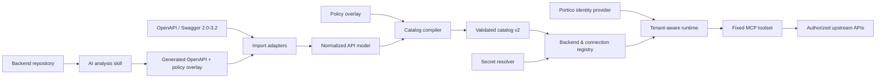
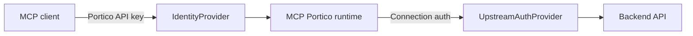

# MCP Portico

**A generic, multi-tenant MCP frontend for HTTP APIs.**

[](https://github.com/yashcodelabs/mcp-portico/actions/workflows/ci.yml)
[](LICENSE)
[](package.json)

MCP Portico turns OpenAPI descriptions or inspected backend source code into
policy-controlled MCP connections. One deployment can expose multiple backend
systems while isolating tenants, credentials, catalogs, and runtime sessions.

> **Status:** Phase 1 (foundation) complete. This repository is a fresh
> implementation following the
> [implementation plan](docs/mcp-portico-implementation-plan.md).

## Why MCP Portico

- **The catalog is the gate** - operations are compiled from OpenAPI/Swagger or
  AI-analyzed backend metadata into a validated catalog. Only catalog-gated
  operations can run, keyed by stable operation ID.
- **One deployment, many backends** - a backend registry and tenant-scoped
  connections isolate URLs, credentials, and policies.
- **A fixed MCP toolset** - discovery, description, and gated execution instead
  of arbitrary method/path input.
- **An operator CLI** - catalog import/validate/diff, registry validation,
  connection testing, and usage analysis.

## Architecture



## Authentication at two layers



Client credentials and upstream credentials are never shared. Secrets are
stored as environment references, and nothing secret appears in logs,
telemetry, or MCP responses.

## Quick start

```bash
# Prerequisites: Node.js >= 22 and pnpm 11
pnpm install
pnpm ci:check   # typecheck, format, tests, sweeps, build, smoke
pnpm serve      # Phase 1 health server on http://127.0.0.1:3000
```

`mcp-portico --help` and `mcp-portico serve` are available after `pnpm build`.

## Planned interface

```text
mcp-portico serve
mcp-portico catalog import <openapi-file>
mcp-portico catalog validate <catalog-file>
mcp-portico catalog diff <old-catalog> <new-catalog>
mcp-portico registry validate <registry-file>
mcp-portico connection test <connection-id>
```

## What's next

The [implementation plan](docs/mcp-portico-implementation-plan.md) defines
seven phases: catalog v2 and the deterministic compiler (2), tenant registry
and authentication (3), OpenAPI importers (4), the operation runtime (5), the
AI backend-analysis skill (6), and the inspector plus clean cutover (7).

## Contributing

See [CONTRIBUTING.md](CONTRIBUTING.md) for setup and verification requirements,
[SECURITY.md](SECURITY.md) for the security policy, and
[docs/deprecation-inventory.md](docs/deprecation-inventory.md) for the legacy
module removal map.

## License

Apache-2.0. See [LICENSE](LICENSE).
