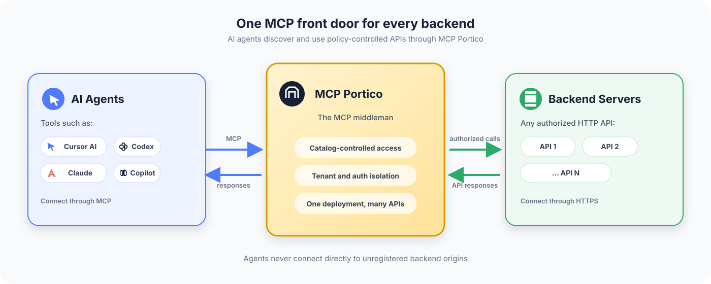
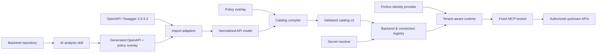
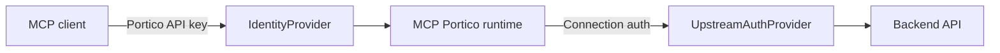

# MCP Portico

**A generic, multi-tenant MCP frontend for HTTP APIs.**

[](https://github.com/yashcodelabs/mcp-portico/actions/workflows/ci.yml)
[](LICENSE)
[](package.json)

MCP Portico turns OpenAPI descriptions or inspected backend source code into
policy-controlled MCP connections. One deployment can expose multiple backend
systems while isolating tenants, credentials, catalogs, and runtime sessions.

> **Status:** Phases 1-3 complete: foundation and safety harness, catalog v2
> with the deterministic compiler, and the tenant registry, connections, and
> API-key authentication model. This repository is a fresh implementation
> following the [implementation plan](docs/mcp-portico-implementation-plan.md).

## Why MCP Portico

- **The catalog is the gate** - operations are compiled from OpenAPI/Swagger or
  AI-analyzed backend metadata into a validated catalog. Only catalog-gated
  operations can run, keyed by stable operation ID.
- **One deployment, many backends** - a backend registry and tenant-scoped
  connections isolate URLs, credentials, and policies.
- **A fixed MCP toolset** - discovery, description, and gated execution instead
  of arbitrary method/path input.
- **An operator CLI** - catalog import/validate/diff, registry validation,
  connection testing, and usage analysis.

## Architecture





## Authentication at two layers



Client credentials and upstream credentials are never shared. Secrets are
stored as environment references, and nothing secret appears in logs,
telemetry, or MCP responses.

## Quick start

```bash
# Prerequisites: Node.js >= 22 and pnpm 11
pnpm install
pnpm ci:check   # typecheck, format, tests, sweeps, build, smoke
pnpm serve      # health server on http://127.0.0.1:3000
```

`mcp-portico --help` and `mcp-portico serve` are available after `pnpm build`.

## Interface

```text
mcp-portico serve --registry <registry-file>      # implemented
mcp-portico catalog import <openapi-file>         # Phase 4
mcp-portico catalog validate <catalog-file>       # implemented
mcp-portico catalog diff <old> <new>              # implemented
mcp-portico registry validate <registry-file>     # implemented
mcp-portico key create --registry <file> --tenant <id> --principal <id>   # implemented
mcp-portico connection test <connection-id> --registry <file>   # implemented
```

`serve` loads and validates the registry at startup (and reloads it atomically
when the file changes), enforcing secret resolution and destination security
policy before listening.

The catalog v2, policy overlay, and registry v1 JSON Schemas are published
under [`schemas/`](schemas/); see
[`examples/sample-catalog.json`](examples/sample-catalog.json) for a compiled
example and [`examples/sample-overlay.json`](examples/sample-overlay.json) for
its policy overlay. Registries in JSON and YAML form are in
[`examples/sample-registry.json`](examples/sample-registry.json) and
[`examples/sample-registry.yaml`](examples/sample-registry.yaml); the
[`docs/registry.md`](docs/registry.md) guide covers the file format, network
and policy fields, and the API-key lifecycle.

## Configuration

Configuration is environment-based (all variables use the `MCP_PORTICO_`
prefix):

- `MCP_PORTICO_KEY_PEPPER` - required to create Portico API keys and to run in
  bearer auth mode. Keys are stored only as HMAC digests keyed by this pepper;
  losing it invalidates every key.
- `MCP_PORTICO_AUTH_MODE` - `none` (loopback only) or `bearer` (default
  `none`).
- `MCP_PORTICO_HOST` / `MCP_PORTICO_PORT` - server bind address and port.
- `MCP_PORTICO_CONFIG_HOME` - override the user config directory.

Upstream connection secrets are referenced as `env:VARIABLE_NAME` in the
registry and resolved from the server's environment. Unknown references fail
startup or connection activation.

## What's next

The [implementation plan](docs/mcp-portico-implementation-plan.md) defines
seven phases: foundation (1, done), catalog v2 and the deterministic compiler
(2, done), tenant registry and authentication (3, done), OpenAPI importers
(4, next), the operation runtime (5), the AI backend-analysis skill (6), and
the inspector plus clean cutover (7).

## Contributing

See [CONTRIBUTING.md](CONTRIBUTING.md) for setup and verification requirements,
[SECURITY.md](SECURITY.md) for the security policy, and
[docs/deprecation-inventory.md](docs/deprecation-inventory.md) for the legacy
module removal map.

## License

Apache-2.0. See [LICENSE](LICENSE).
