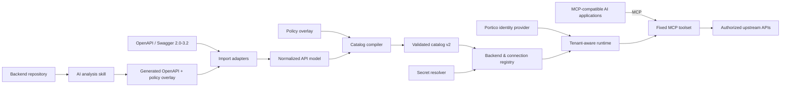
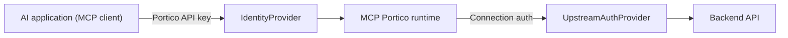

# MCP Portico

**A client-neutral MCP gateway for any MCP-compatible AI application.**

[](https://github.com/yashcodelabs/mcp-portico/actions/workflows/ci.yml)
[](LICENSE)
[](package.json)

MCP Portico connects MCP-compatible AI applications - coding assistants,
support and service-desk agents, finance and operations agents, workflow and
voice copilots, and custom MCP hosts - to approved internal APIs and backend
systems. OpenAPI descriptions or inspected backend source code are compiled
into policy-controlled catalogs, and one deployment can expose multiple
backend systems while isolating tenants, credentials, catalogs, and runtime
sessions.

MCP Portico is not tied to a particular model, vendor, agent framework, or
user-interface type: any application that speaks MCP can connect. It does
not own or provision the model, the agent, or the upstream identity
provider; it secures the boundary between them and your internal systems.

> **Status:** Phases 1-7 complete, v1 ready: foundation and safety harness,
> catalog v2 with the deterministic compiler, the tenant registry,
> connections, and API-key authentication model, the OpenAPI/Swagger
> importers, and the fixed MCP toolset with the operation runtime and
> generic transports, plus the AI backend-analysis skill, the read-only
> tenant-scoped inspector, examples, migration notes, and release
> packaging. This repository is a fresh implementation following the
> [implementation plan](https://github.com/yashcodelabs/mcp-portico/blob/main/docs/mcp-portico-implementation-plan.md).

**Roadmap:** The [client-neutral MCP roadmap](https://github.com/yashcodelabs/mcp-portico/blob/main/docs/roadmap.md)
tracks the evolution from a v1 HTTP API gateway to a client-neutral access
layer for any MCP-compatible AI application.

## Why MCP Portico

- **Any MCP client, one gateway** - coding assistants, support agents,
  workflow agents, BI agents, voice agents, and custom applications all
  speak the same MCP protocol and use the same fixed toolset. No vendor,
  model, or agent framework is required.
- **The catalog is the gate** - operations are compiled from OpenAPI/Swagger
  or AI-analyzed backend metadata into a validated catalog. Only
  catalog-gated operations can run, keyed by stable operation ID.
- **One deployment, many backends** - a backend registry and tenant-scoped
  connections isolate URLs, credentials, and policies.
- **A fixed MCP toolset** - discovery, description, and gated execution
  instead of arbitrary method/path input.
- **An operator CLI** - catalog import/validate/diff, registry validation,
  connection testing, and usage analysis.

## Architecture

MCP Portico is the security and policy boundary between AI applications and
internal systems: it authenticates the calling MCP client, resolves tenant
and connection context server-side, and enforces catalog and connection
policy on every operation. Backend credentials never reach the client.




## Authentication at two layers



The client credential identifies the calling application's principal and is
never reused as an upstream credential. Client authentication, tenant
selection, and upstream authentication are separate contracts; only the
operator-configured connection supplies the backend origin and credentials.
Secrets are stored as environment references, and nothing secret appears in
logs, telemetry, or MCP responses.

## Quick start

```bash
# Prerequisites: Node.js >= 22 and pnpm 11
pnpm install
pnpm ci:check   # typecheck, format, tests, sweeps, build, smoke
pnpm serve      # health server on http://127.0.0.1:3000
```

`mcp-portico --help` and `mcp-portico serve` are available after `pnpm build`.

## Install from npm

The `mcp-portico` npm package ships the CLI, JSON Schemas, public MCP
compatibility contracts, and runnable examples. The first public release will
also make the following installation command available:

```bash
npm install -g mcp-portico
mcp-portico --help
```

The package builds a fresh `dist/` on pack, so the tarball never contains
stale build output.

The supported npm surface is the `mcp-portico` executable, published JSON
Schemas, and the accompanying documentation. The compiled internal modules are
not a stable TypeScript library API.

## Interface

```text
mcp-portico serve --registry <registry-file>      # implemented
mcp-portico catalog import <openapi-file> --api-id <id> --output <catalog> --report <report>   # implemented
mcp-portico catalog import <ai-openapi> --api-id <id> --ai --overlay <overlay> --output <catalog> --report <report>   # implemented (AI-analysis artifacts)
mcp-portico catalog validate <catalog-file>       # implemented
mcp-portico catalog diff <old> <new>              # implemented
mcp-portico registry validate <registry-file>     # implemented
mcp-portico key create --registry <file> --tenant <id> --principal <id>   # implemented
mcp-portico connection test <connection-id> --registry <file>   # implemented
```

`serve` loads and validates the registry at startup (and reloads it atomically
when the file changes), enforcing secret resolution and destination security
policy before listening.

## Importing a catalog

`catalog import` compiles a Swagger 2.0 or OpenAPI 3.0-3.2 document (JSON or
YAML) into a validated, credential-free catalog and a structured report. It
never touches the registry.

```bash
mcp-portico catalog import ./petstore.yaml \
  --api-id petstore \
  --output ./catalogs/petstore-1.0.0.json \
  --report ./catalogs/petstore-1.0.0.report.json \
  --overlay ./petstore.overlay.json
```

External `$ref` documents are denied by default. To import them, permit
relative file refs (`--allow-file-refs`) and/or remote refs
(`--allow-remote-refs` with `--remote-host <host>`); remote refs are
https-only unless `--allow-http` is set, and private/loopback destinations
require `--allow-private-network`. The report records every dropped
unsupported feature (callbacks, links, webhooks, unsupported content types,
unsupported security schemes) so nothing is dropped silently.

The catalog v2, policy overlay, and registry v1 JSON Schemas are published
under [`schemas/`](schemas/); see
[`examples/sample-catalog.json`](examples/sample-catalog.json) for a compiled
example and [`examples/sample-overlay.json`](examples/sample-overlay.json) for
its policy overlay. Registries in JSON and YAML form are in
[`examples/sample-registry.json`](examples/sample-registry.json) and
[`examples/sample-registry.yaml`](examples/sample-registry.yaml); the
[`docs/registry.md`](docs/registry.md) guide covers the file format, network
and policy fields, and the API-key lifecycle.

## Configuration

Configuration is environment-based (all variables use the `MCP_PORTICO_`
prefix):

- `MCP_PORTICO_KEY_PEPPER` - required to create Portico API keys and to run in
  bearer auth mode. Keys are stored only as HMAC digests keyed by this pepper;
  losing it invalidates every key.
- `MCP_PORTICO_AUTH_MODE` - `none` (loopback only, health-only serving without
  a registry) or `bearer` (default `none`). `none` combined with `--registry`
  fails startup: tenant-aware MCP tools, resources, and the inspector require
  an authenticated principal, so serve a registry with `bearer`.
- `MCP_PORTICO_HOST` / `MCP_PORTICO_PORT` - server bind address and port.
- `MCP_PORTICO_CONFIG_HOME` - override the user config directory.

Upstream connection secrets are referenced as `env:VARIABLE_NAME` in the
registry and resolved from the server's environment. Unknown references fail
startup or connection activation.

## Examples

- [CLI walkthrough](examples/README.md) - import a public API into a
  catalog, validate a registry, create keys, serve, and drive an MCP session
  over HTTP.
- [Domain use cases](examples/use-cases/README.md) - a support agent, an
  operations and finance agent, and a workflow agent with confirmation, with
  fixture catalogs and a clear split between generic MCP behavior and
  backend-specific catalog configuration.
- [MCP compatibility contract](docs/mcp-compatibility-contract.md)
  - lifecycle, fixed tools, transport profiles, limits, and errors.
- [MCP client integration guide](docs/mcp-client-integration.md)
  - generic, remote, and custom-host integration examples.
- [Interoperability matrix](docs/mcp-interoperability-matrix.md)
  - deterministic cross-transport contract scenarios.

## What's next

All seven phases of the [implementation plan](https://github.com/yashcodelabs/mcp-portico/blob/main/docs/mcp-portico-implementation-plan.md)
are complete. The [roadmap](https://github.com/yashcodelabs/mcp-portico/blob/main/docs/roadmap.md)
now prioritizes operational policy administration, durable observability,
external secret providers, additional upstream authentication, OAuth, and
multi-replica administration.

## Contributing

See [CONTRIBUTING.md](CONTRIBUTING.md) for setup and verification requirements,
[SECURITY.md](SECURITY.md) for the security policy, and
[CODE_OF_CONDUCT.md](CODE_OF_CONDUCT.md) for community expectations. See
[SUPPORT.md](SUPPORT.md) for support and issue guidance, and
[docs/deprecation-inventory.md](docs/deprecation-inventory.md) for the legacy
module removal map.

## License

Apache-2.0. See [LICENSE](LICENSE).
