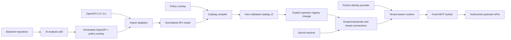

# MCP Portico implementation plan

**Status:** Approved for planning  
**Date:** 2026-08-02  
**Target:** Replace the product-specific CLI/MCP server with a generic, multi-tenant MCP frontend for HTTP APIs.

## 1. Product definition

MCP Portico turns OpenAPI descriptions or inspected backend source code into policy-controlled MCP connections. One deployment can expose multiple backend systems while isolating tenants, credentials, catalogs, and runtime sessions.

The catalog is the runtime gate. MCP Portico must reject any operation, content type, authentication requirement, or target connection that is not explicitly present and enabled in the compiled catalog and registry.

### Locked decisions

- Product name: **MCP Portico**
- Repository and npm package: `mcp-portico`
- Executable: `mcp-portico`
- Environment prefix: `MCP_PORTICO_*`
- Config home: `~/.config/mcp-portico`
- License: Apache-2.0
- Administration in v1: config-as-code plus an operator CLI
- Runtime topology in v1: one process/replica
- Registry in v1: version-controlled YAML/JSON files
- Catalog import is an operator-only build step. It produces an inert, credential-free artifact and never creates, updates, or activates a registry entry or connection.
- Backends are explicitly scoped as `global` or `tenant`. Tenant-scoped backends have exactly one owning tenant; global backends may be referenced by connections from multiple tenants.
- Every connection belongs to exactly one tenant. A connection may reference only a global backend or a backend owned by that same tenant.
- Imported server URLs are non-authoritative hints. Runtime origins, credentials, headers, and tenant-specific policy come only from validated connection configuration.
- Secret source in v1: environment-variable references
- Client authentication in v1: hashed static bearer API keys
- Upstream authentication in v1: none, bearer, API key, Basic, and controlled static headers
- OpenAPI input: Swagger 2.0 and OpenAPI 3.0, 3.1, and 3.2 in JSON or YAML
- AI repository analysis: generate OpenAPI plus a policy overlay, then use the same deterministic compiler
- Compatibility: clean break; no legacy compatibility layer
- Primary development environment: WSL 2 using the native Linux filesystem and Linux-native Git, Node.js, and pnpm
- Required compatibility targets: Linux and macOS; Windows support is secondary and must not constrain Unix-native behavior

### Development and verification environment

- The primary working copy must live inside the WSL filesystem, for example `~/projects/mcp-portico`, rather than under `/mnt/c`.
- Development, dependency installation, builds, tests, CLI smoke tests, and local server runs use WSL/Linux tooling.
- Do not alternate Windows and WSL tooling against the same checkout or share `node_modules` between operating systems.
- Linux CI and macOS CI are required release gates. WSL is the local Linux baseline, but it does not replace macOS CI because filesystem behavior and platform APIs differ.
- Shell commands and npm scripts must be POSIX-compatible where practical. Cross-platform Node.js scripts are preferred over shell-specific automation.
- Windows CI may remain as a secondary compatibility signal, but Phase 1 and release completion are based on passing Linux and macOS verification.

## 2. Scope

### Goals

- Expose any supported HTTP backend through a small, stable MCP toolset.
- Compile OpenAPI or AI-discovered metadata into one validated catalog format.
- Gate execution by stable operation ID rather than arbitrary method/path input.
- Host multiple backend definitions and connections in one deployment.
- Isolate tenants, connections, credentials, sessions, limits, and audit records.
- Support JSON, forms, multipart files, binary bodies, and text bodies.
- Keep an operator CLI for generation, validation, testing, serving, and usage analysis.
- Preserve useful infrastructure from the current project where it is generic.

### Non-goals for v1

- Database-backed configuration or a writable administration UI
- Multi-replica/HA deployment
- OAuth authorization-code or delegated-user flows
- OAuth client credentials, refresh-token management, mTLS, cloud identity, or request signing
- GraphQL-, gRPC-, SOAP-, or database-native catalog importers
- Full support for OpenAPI callbacks, links, and webhooks
- Generating one MCP tool per HTTP endpoint
- Backward compatibility with legacy configuration, tools, presets, or CLI commands

## 3. Core terminology

| Term              | Definition                                                                                                                                          |
| ----------------- | --------------------------------------------------------------------------------------------------------------------------------------------------- |
| Backend           | A registry record for one API definition and catalog checksum. It is either global or owned by one tenant and contains no deployment credentials.   |
| Connection        | A tenant-owned deployment of a permitted backend: base URL, environment, authentication, headers, and restrictive policy.                           |
| Tenant            | The isolation boundary that owns principals, connections, tenant-scoped backends, runtime state, limits, and audit visibility.                      |
| Principal         | An authenticated MCP client identity belonging to exactly one tenant.                                                                               |
| Session           | Temporary MCP state bound to an authenticated tenant and principal, including a selected connection. A session is never an authentication boundary. |
| Catalog           | An immutable, credential-free, compiled allowlist of operations and schemas identified by checksum.                                                 |
| Policy overlay    | Human-reviewed rules compiled into a catalog to enrich or restrict imported API metadata.                                                           |
| Connection policy | Tenant-specific rules that may only further restrict a catalog; they cannot add operations or weaken catalog security requirements.                 |

### Multi-tenant ownership and authorization invariants

These invariants apply to import, registry validation, discovery, execution, caching, telemetry, inspection, and configuration reload:

1. Importing or copying a catalog grants no tenant or principal access. Access exists only through an enabled connection in the validated registry.
2. Catalog files are immutable build artifacts keyed by checksum. A global catalog may be shared in memory because it contains no tenant URLs, credentials, secrets, or mutable tenant state.
3. Backend IDs, connection IDs, tenant IDs, and principal IDs are unique in their registry namespace. A tenant-scoped backend requires `ownerTenantId`; a global backend must not have one.
4. A connection has exactly one `tenantId` and one `backendId`. Registry validation rejects a missing backend, a cross-tenant private-backend reference, a missing catalog, or a catalog checksum mismatch.
5. A principal belongs to exactly one tenant. Every connection in its v1 allowlist must exist and have the same `tenantId`.
6. Tenant and principal identity are derived exclusively from the authenticated Portico credential. MCP arguments, headers, session payloads, imported documents, and upstream responses cannot select or override them.
7. Every discovery, description, call, bulk call, health test, and inspector query re-authorizes the selected connection against the current authenticated principal and current registry snapshot.
8. A connection policy is monotonic: it may disable operations, reduce limits, require stricter confirmation, add redaction, or constrain content types and headers. It cannot enable a catalog-disabled operation, add an operation, change its method/path, widen schemas, remove security requirements, relax confirmation, or raise catalog limits.
9. Sessions store opaque IDs plus the bound `tenantId`, `principalId`, selected `connectionId`, registry revision, and catalog checksum. Every request is re-authenticated; mismatched, stale, revoked, or cross-principal session state is rejected or safely reselected.
10. All mutable runtime keys include the isolation dimensions they depend on. Rate limits and concurrency include tenant and connection; sessions include tenant and principal; response caches include tenant, connection, catalog checksum, operation, normalized input, and principal whenever output can vary by principal. No response cache entry is reused across tenants or connections.
11. Audit events include tenant, principal, connection, backend, catalog checksum, operation, registry revision, outcome, and duration. Inspector and usage queries are tenant-filtered before pagination or aggregation so counts and existence cannot leak across tenants.
12. Registry and catalog reload is atomic. The complete candidate snapshot is validated before publication; failure preserves the prior snapshot. Removed authorization, changed ownership, disabled connections, and catalog checksum changes invalidate affected session selections and cache entries.

## 4. Target architecture



### Suggested source layout

```text
src/
  auth/                 # Portico identity and upstream auth providers
  catalog/              # v2 schema, loader, validator, compiler, diff
  cli/                  # operator CLI only
  importers/
    openapi/             # OpenAPI 2.0 and 3.x adapters
  registry/             # tenants, principals, backends, connections
  runtime/              # operation execution, transport selection, limits
  mcp/                  # MCP HTTP transport and fixed tool registration
  inspector/            # read-only operational UI
  telemetry/            # audit and usage persistence
  shared/               # errors, logging, redaction, utilities
schemas/                # published JSON Schemas
examples/               # sample specs, overlays, registries, and catalogs
test/fixtures/           # importer and runtime fixtures
```

## 5. Public interfaces

### Operator CLI

```text
mcp-portico serve
mcp-portico catalog import <openapi-file> --api-id <api-id> --output <catalog-file> --report <report-file> [--overlay <overlay-file>]
mcp-portico catalog validate <catalog-file>
mcp-portico catalog diff <old-catalog> <new-catalog>
mcp-portico registry validate <registry-file>
mcp-portico connection test <connection-id>
mcp-portico key create --tenant <tenant-id> --principal <principal-id>
mcp-portico usage summary
```

The CLI must not expose domain-specific endpoint commands or a generic arbitrary HTTP client. `catalog import` writes a catalog and import report only; it does not mutate the registry or make the backend visible to any tenant. An operator must separately add or update a backend record, pin its checksum, create tenant-owned connections, validate the complete registry, and publish that registry snapshot.

### Fixed MCP toolset

| Tool                 | Purpose                                                           |
| -------------------- | ----------------------------------------------------------------- |
| `list_connections`   | List connections authorized for the current principal.            |
| `select_connection`  | Select one authorized connection for the MCP session.             |
| `get_session`        | Return redacted principal, tenant, connection, and catalog state. |
| `search_operations`  | Search authorized catalog operations by text, tag, or risk.       |
| `describe_operation` | Return the complete input contract for an operation ID.           |
| `call_operation`     | Execute one catalog operation.                                    |
| `call_operations`    | Execute a bounded batch of independent operations.                |
| `test_connection`    | Perform the configured health/authentication probe.               |

`call_operation` must use `operationId`. It must not accept arbitrary upstream base URLs, tenant IDs, principal IDs, backend IDs, credentials, or a connection other than the session's currently authorized selection. Raw method/path execution may exist only in an explicitly enabled loopback debugging mode, must still be catalog-gated, and must not bypass tenant authorization.

## 6. Authentication and secret strategy

### Portico client authentication

For v1, HTTP MCP clients authenticate with a high-entropy bearer API key:

```http
Authorization: Bearer mpp_<key-id>_<secret>
```

The registry stores the public key ID and a keyed HMAC digest, never the plaintext key. `MCP_PORTICO_KEY_PEPPER` supplies the server-side pepper. Authentication uses constant-time comparison. Each v1 principal maps to exactly one tenant and an explicit allowlist of same-tenant connection IDs. Role-based authorization is post-v1.

`MCP_PORTICO_AUTH_MODE=none` is permitted only when the server binds to a loopback interface. Once tenant-aware MCP tools are enabled, unauthenticated mode also requires an explicitly configured synthetic local-development principal that belongs to exactly one tenant and has an explicit connection allowlist; startup fails otherwise. Tenant or connection identity is never inferred from tool arguments. Remote binding with authentication disabled must fail startup validation.

Define an `IdentityProvider` interface in phase 1 so OAuth 2.1 can replace static keys later without changing MCP tool handlers.

### Upstream backend authentication

Every connection selects an `UpstreamAuthProvider`. Built-in v1 providers:

- `none`
- `bearer`
- `apiKey` in a header or query parameter
- `basic`
- `staticHeaders` with an explicit header allowlist

Example:

```yaml
tenants:
  acme:
    name: Acme
  globex:
    name: Globex

backends:
  billing:
    scope: global
    catalogRef: ./catalogs/billing-1.4.0.json
    catalogChecksum: sha256:...
  acme-ledger:
    scope: tenant
    ownerTenantId: acme
    catalogRef: ./catalogs/acme-ledger-2.0.0.json
    catalogChecksum: sha256:...

connections:
  acme-billing-prod:
    tenantId: acme
    backendId: billing
    baseUrl: https://billing.example.com
    auth:
      type: bearer
      tokenRef: env:BILLING_PROD_TOKEN
    policy:
      disabledOperations: [invoice.delete]
      maxConcurrency: 2
  globex-billing-prod:
    tenantId: globex
    backendId: billing
    baseUrl: https://billing.globex.example
    auth:
      type: apiKey
      in: header
      name: X-API-Key
      valueRef: env:GLOBEX_BILLING_API_KEY
  acme-ledger-prod:
    tenantId: acme
    backendId: acme-ledger
    baseUrl: https://ledger.internal.example
    auth:
      type: none
```

Rules:

- Catalogs and registries contain secret references, not secrets.
- V1 resolves only `env:VARIABLE_NAME` references.
- Secrets never appear in MCP responses, inspector payloads, telemetry, errors, or logs.
- Imported OpenAPI `servers` and Swagger `host`, `schemes`, and `basePath` values are recorded only as sanitized import-report hints. They never create a connection or override its `baseUrl`.
- A connection's `baseUrl`, including any deployment-specific path prefix, is authoritative and is joined with catalog paths by a traversal-safe URL builder.
- The compiler records OpenAPI security requirements for each operation.
- An operation remains unavailable when its required security scheme cannot be satisfied by the selected connection. Registry validation reports incompatible connections before activation.
- Portico client credentials are never forwarded upstream.
- Connection-level static headers cannot override hop-by-hop, host, content-length, or Portico security headers.
- Connection health tests, import-reference fetches, and runtime calls use separate credential and network-policy contexts; import never sends tenant connection credentials to documentation or `$ref` origins.

## 7. Catalog v2

The v2 catalog is a compiled artifact with a stable operation index. A simplified shape:

```json
{
  "catalogVersion": "2.0",
  "api": {
    "id": "billing",
    "title": "Billing API",
    "version": "1.4.0"
  },
  "provenance": {
    "sourceType": "openapi",
    "sourceChecksum": "sha256:...",
    "generatedAt": "2026-08-02T00:00:00Z"
  },
  "operations": {
    "invoice.get": {
      "method": "GET",
      "path": "/invoices/{invoiceId}",
      "tags": ["invoices"],
      "risk": "read",
      "request": {},
      "responses": {}
    }
  }
}
```

Required catalog capabilities:

- Stable operation IDs, with deterministic generated IDs when OpenAPI omits them
- Path, query, header, cookie, and body parameter schemas
- Request and response content types and JSON Schemas
- Security-scheme requirements
- Risk classification: `read`, `write`, or `destructive`
- Confirmation policy
- Per-operation timeout, request-size, response-size, and concurrency limits
- Sensitive-field redaction rules
- Cache eligibility and TTL
- Tags, summaries, descriptions, examples, and deprecation metadata
- Provenance, source checksum, compiler version, warnings, and confidence
- Semantic checks beyond JSON Schema validation
- Deterministic serialization so identical inputs produce identical catalogs

Policy overlays may disable operations, replace generated descriptions, assign risk, add context-derived headers, add limits, or mark fields sensitive. Overlays may restrict imported behavior but must not silently introduce an operation that does not exist in the normalized API model. An overlay compiled into a catalog applies to every connection using that catalog. Tenant-specific restrictions belong in monotonic connection policy; if a tenant requires a materially different API contract or non-monotonic metadata, compile a separate catalog and backend record.

## 8. Phased implementation

### Phase 1 — Foundation, rebrand, and safety harness

**Objective:** Establish MCP Portico identity, repository boundaries, and a stable verification baseline before changing runtime behavior.

Work:

- Rename package, executable, config paths, headers, environment variables, server metadata, docs, and skills to MCP Portico.
- Add Apache-2.0 license, public README skeleton, security policy, and contribution notes.
- Create the target module directories while leaving the old runtime functional.
- Introduce shared secret-redaction and structured-error utilities.
- Introduce `IdentityProvider`, `SecretResolver`, and `UpstreamAuthProvider` interfaces.
- Add a deprecation/removal inventory for all legacy modules.
- Repair dependency installation and make build/test execution reliable in WSL/Linux and macOS.
- Add CI jobs for formatting/typecheck, unit tests, integration tests, catalog fixtures, and secret/reference sweeps.

Tests:

- Clean install, build, and test on supported Node versions in WSL/Linux, with equivalent clean-install verification on macOS CI.
- Brand-reference sweep contains no legacy product names.
- Redaction tests cover authorization, API keys, cookies, and configured sensitive fields.
- Loopback-only validation for unauthenticated mode.

Exit criteria:

- `mcp-portico --help`, `mcp-portico serve`, build, and tests run reliably.
- The old runtime is still callable while new module interfaces are available.
- CI prevents reintroduction of product-specific references or committed secrets.

### Phase 2 — Catalog v2 and deterministic compiler

**Objective:** Define the long-lived contract that all importers and runtime execution share.

Work:

- Publish catalog v2 JSON Schema under `schemas/`.
- Implement syntactic and semantic catalog validation.
- Create the normalized API intermediate representation.
- Implement policy-overlay schema and merger.
- Compile normalized models plus overlays into deterministic catalogs.
- Implement operation ID generation and collision reporting.
- Add catalog checksum, provenance, compiler warnings, confidence, and diff support.
- Keep catalog artifacts credential-free and immutable by checksum so a global backend definition is safe to share across tenant connections.
- Add `catalog validate` and `catalog diff` CLI commands.
- Convert a small generic sample API manually as the reference fixture.

Tests:

- Golden catalog fixtures and deterministic-output snapshots.
- Invalid schemas, duplicate IDs, unresolved security schemes, unsafe paths, and unsupported content types fail closed.
- Overlay tests verify that policies restrict or annotate but cannot invent operations.
- Catalog diff classifies additions, removals, schema changes, and risk changes.

Exit criteria:

- A catalog can be compiled, validated, diffed, loaded, and indexed without legacy code.
- Identical inputs generate byte-identical canonical output except explicitly excluded timestamps.

### Phase 3 — Tenant registry, connections, and authentication

**Objective:** Build the security and isolation model before exposing the new execution runtime.

Work:

- Define schemas for tenants, principals, backends, and connections.
- Define backend scope and ownership: `scope: global` forbids `ownerTenantId`; `scope: tenant` requires an existing `ownerTenantId`.
- Require each backend record to pin `catalogRef` and `catalogChecksum`; load catalogs read-only and deduplicate identical checksums without sharing mutable tenant state.
- Define a monotonic connection-policy schema and validation against the referenced catalog.
- Implement YAML/JSON registry loading and startup validation.
- Enforce complete referential integrity: owners, principal tenants, backend owners, connection tenants/backends, and principal connection allowlists must exist; deleting a referenced tenant, backend, connection, or catalog fails validation until dependents are removed in the same candidate snapshot.
- Implement static bearer API-key identity with tenant and connection authorization.
- Add `key create`, `registry validate`, and `connection test` CLI commands.
- Implement environment secret references and all five v1 upstream auth providers.
- Namespace session state by authenticated principal and tenant.
- Add per-tenant and per-connection rate/concurrency limit hooks.
- Namespace caches, circuit breakers, health state, and mutable counters by tenant and connection; include principal when results or policy can vary by principal.
- Add audit records containing principal, tenant, connection, backend, catalog checksum, registry revision, operation, outcome, and duration.
- Prevent arbitrary base URL and credential overrides from MCP tool arguments and client headers.
- Implement atomic registry/catalog snapshot publication and invalidate affected selections and caches on revocation, ownership changes, connection changes, or catalog updates.

Security work:

- Restrict protocols to configured HTTP/HTTPS policy.
- Disable redirects by default; allow only explicitly configured same-origin redirects.
- Reject loopback, link-local, metadata-service, and private-network targets unless the connection explicitly permits them.
- Resolve and validate destinations at connection load and request time to reduce DNS rebinding risk.
- Strip hop-by-hop and unapproved client headers.
- Fail registry validation for cross-tenant principal allowlists, cross-tenant private-backend references, missing or mismatched catalog checksums, non-monotonic connection policy, duplicate IDs, and auth/catalog incompatibility.

Tests:

- Cross-tenant connection access is denied.
- A global backend can serve two tenants only through separate tenant-owned connections, and neither tenant can observe the other's connection, URL, policy, credentials, health, limits, cache entries, or audit records.
- A tenant-scoped backend cannot be referenced, discovered, tested, inspected, or inferred by another tenant.
- Importing a catalog and adding a backend record without a connection grants no principal access.
- A session ID cannot be reused to cross a principal boundary.
- Session selection is invalidated safely after principal revocation, connection removal, ownership changes, policy changes, and catalog replacement.
- Bulk calls cannot mix connections or smuggle tenant/connection identifiers in individual items.
- Auth providers inject credentials correctly without logging them.
- Unknown secret references fail startup or connection activation.
- SSRF, redirect, DNS, and header-injection test matrix.
- Cache, rate-limit, concurrency, health-state, inspector-count, pagination, error-message, and audit-query isolation tests use colliding operation IDs and inputs across tenants.
- Invalid candidate registry reloads leave the previous complete snapshot active; valid revocations take effect before the next operation.

Exit criteria:

- An authenticated principal can see only authorized connections.
- Registry validation proves every principal allowlist and connection/backend edge respects tenant ownership.
- No client-controlled request value can select an unregistered upstream origin.
- Credentials are absent from all observable runtime outputs.

### Phase 4 — OpenAPI and Swagger importers

**Objective:** Convert standard API descriptions into the normalized model and catalog v2.

Work:

- Parse JSON and YAML inputs.
- Support Swagger 2.0 and OpenAPI 3.0, 3.1, and 3.2.
- Resolve local and explicitly permitted remote references with cycle detection and size limits.
- Treat root documents and remote references as untrusted build inputs. Apply protocol/host allowlists, DNS and redirect checks, timeouts, aggregate byte/depth/document limits, and never use runtime connection credentials while fetching them.
- Normalize paths, operation IDs, parameters, request bodies, responses, tags, security schemes, examples, and deprecations.
- Convert Swagger 2.0 definitions, body/form parameters, and security definitions. Record OpenAPI servers and Swagger host/basePath/schemes as non-authoritative import-report hints rather than runtime routing configuration.
- Emit structured coverage and unsupported-feature reports.
- Add `catalog import` CLI command with explicit API ID, output path, overlay support, source checksum, and atomic output. It must not read, mutate, or activate registry state.
- Require an explicit operator registry change to assign backend scope/ownership, pin the catalog checksum, and create tenant connections after reviewing the import report and catalog diff.
- Add representative fixtures for each supported specification version.

Unsupported features must produce warnings or hard failures according to policy. Callbacks, links, and webhooks are not executable in v1.

Tests:

- Golden import fixtures for OpenAPI 2.0, 3.0, 3.1, and 3.2.
- JSON and YAML versions generate equivalent normalized models.
- Reference cycles, external-reference restrictions, duplicate operation IDs, and incompatible schemas are reported.
- Authentication and multipart definitions survive import accurately.
- Import output contains no source credentials, authorization headers, tenant identifiers, fetched URL user-info, or secret query parameters.
- Importing identical source and overlay inputs for two intended tenants produces the same inert catalog; isolation begins only when separately validated connections are configured.

Exit criteria:

- All supported fixture versions compile into valid catalog v2 artifacts.
- The importer never silently drops an executable operation or security requirement.
- Import alone cannot make a backend or operation discoverable or executable.

### Phase 5 — Operation runtime and generic transports

**Objective:** Cut over from raw path-based calls and legacy tools to catalog operation execution.

Work:

- Implement `list_connections`, `select_connection`, `get_session`, `search_operations`, `describe_operation`, `call_operation`, `call_operations`, and `test_connection`.
- Derive tenant and principal only from current authentication, then execute only by operation ID against the selected, currently authorized connection and its pinned catalog checksum.
- Re-authorize connection ownership, principal allowlist, backend visibility, connection policy, catalog availability, and catalog/connection authentication compatibility before every discovery or execution action.
- Validate path/query/header/cookie/body input using catalog schemas.
- Render paths and query strings without accepting unmodeled parameters by default.
- Implement JSON, URL-encoded form, multipart, binary, and text request transports.
- Generalize the existing attachment streaming infrastructure.
- Remove hardcoded `/api/assets` behavior and the `asset_upload` tool.
- Add response content-type handling, response-size limits, optional schema validation, and redaction.
- Preserve explicit confirmation for `write` and `destructive` operations according to catalog policy.
- Adapt bounded bulk execution to operation IDs and per-connection limits.
- Adapt MCP Apps/API Explorer UI to operation-based execution.
- Ensure errors are non-enumerating: unauthorized tenant, backend, connection, and operation identifiers return the same external not-found/forbidden shape without revealing existence.

Tests:

- End-to-end calls for every request content type.
- Required and unknown parameter validation.
- Confirmation and risk-policy enforcement.
- Multipart streaming without buffering beyond configured limits.
- Response limits, redaction, schema validation, and malformed upstream responses.
- Bulk isolation, fail-soft/fail-fast behavior, and concurrency limits.
- Shared-global-catalog tests prove that two tenant connections use separate URLs, credentials, policies, limits, caches, health state, sessions, and audit visibility.
- Tenant-private-backend and stale-session tests cover revocation and atomic registry/catalog reload.

Exit criteria:

- The fixed MCP toolset can discover and execute all supported catalog operations.
- Every tool and Apps UI query is tenant-filtered before search, pagination, aggregation, or rendering.
- No production MCP tool accepts arbitrary upstream origins.
- Generic upload tests pass without any endpoint-specific code.

### Phase 6 — AI backend-analysis skill

**Objective:** Let an AI agent inspect backend repositories while preserving the same compiler and review controls used for OpenAPI.

Work:

- Create `.opencode/skills/mcp-portico-analyze/SKILL.md` and its Cursor mirror.
- Define framework-neutral discovery guidance and targeted references for initial supported frameworks.
- Require the skill to produce OpenAPI 3.2 plus a policy-overlay draft, not a production catalog.
- Capture discovered routes, schemas, middleware, authentication, permissions, multipart fields, and response shapes.
- Attach provenance and confidence to generated metadata.
- Generate a review report covering uncovered routes, dynamic behavior, unresolved authorization, and inferred schemas.
- Run generated artifacts through the standard importer/compiler/validator.
- Treat AI output exactly like any other inert import artifact: it has no tenant access until an operator assigns backend scope/ownership, pins its checksum, creates connections, and publishes a validated registry snapshot.

Tests:

- Fixture repositories with known expected routes and security requirements.
- Missing or uncertain authorization lowers confidence and blocks automatic activation.
- Generated OpenAPI and overlays are deterministic enough for reviewable diffs.
- The compiler rejects invented or malformed operations.

Exit criteria:

- An agent can analyze a fixture backend, generate review artifacts, and compile a valid catalog.
- No AI-generated catalog becomes active without deterministic validation and explicit operator action.

### Phase 7 — Inspector, legacy removal, documentation, and release

**Objective:** Complete the clean cutover and ship the first generic release.

Work:

- Rebuild the inspector around the authenticated tenant's authorized connections, catalog metadata, warnings, health tests, audit activity, and redacted runtime state. The v1 HTTP inspector has no global cross-tenant view; deployment-wide summaries are available only through the local operator CLI under host/filesystem administration. Tenant pagination, counts, search, and aggregations must be filtered before computation.
- Keep the inspector read-only except for safe connection tests in v1.
- Remove legacy domain CLI commands and `commander` registrations that expose them.
- Remove legacy first-class tools, CLI proxy, operation aliases, path rewrites, presets, portal login, and fixed org/workspace/locale context.
- Remove catalog generation logic tied to one NestJS codebase.
- Delete or rewrite all legacy tests, fixtures, docs, and skills.
- Add examples for a public OpenAPI API, two tenants, multiple connections, and each auth provider.
- Publish migration notes that explicitly state there is no compatibility layer.
- Run dependency, license, security, secret, branding, and package-content audits.
- Prepare `0.1.0` release of `mcp-portico` under Apache-2.0.

Tests:

- Full clean-install CI on Linux and macOS; Windows may run as a secondary non-blocking compatibility job.
- End-to-end multi-tenant MCP sessions against multiple fixture backends.
- Package smoke test from the packed npm artifact.
- Final scans find no legacy product names, team data, credentials, or hardcoded backend behavior.
- Documentation commands execute exactly as written.

Exit criteria:

- Only MCP Portico public interfaces remain.
- The old runtime and configuration model are fully removed.
- A new user can import an OpenAPI file, configure two connections, start the server, authenticate, discover operations, and execute a gated call from the published documentation.

## 9. Legacy code disposition

### Preserve and adapt

- Streamable HTTP MCP transport and session cleanup
- MCP Apps integration and API Explorer concept
- Catalog loading, checksumming, and schema-validation ideas
- Request body attachments and multipart MCP parsing
- Bulk execution with bounded concurrency
- Usage telemetry and inspector middleware
- Confirmation semantics for mutating operations
- Origin checks, request limits, and structured error handling

### Replace or remove

- `src/bin.ts` and `src/commands/register.ts` domain commands
- `src/core/operations.ts` and `src/core/shared-operations.ts`
- `src/mcp/cli-proxy.ts`
- `src/mcp/intent-aliases.ts`
- First-class/domain tools in `src/mcp/tools.ts`
- Hardcoded path rewrites and body exceptions in `src/mcp/policy.ts`
- Fixed org/workspace/env/locale context and headers
- `asset_upload` and `/api/assets` special handling
- `src/lib/auth-login.ts` and portal/cookie authentication
- Preset files, preset UI, and preset activation tools
- Legacy config home, environment variables, headers, names, docs, and skills
- NestJS/backend-specific catalog source analyzer after the generic AI skill is available
- CLI/MCP parity runner and reports

## 10. Verification strategy

The project must use layered verification:

The primary local verification environment is WSL 2 with the repository stored on its native Linux filesystem. Required CI verification runs on Linux and macOS so Unix compatibility is tested directly; WSL alone is not treated as proof of macOS compatibility.

1. **Schema tests:** catalog, overlay, registry, connection, and auth configuration.
2. **Compiler tests:** deterministic output and semantic validation.
3. **Importer tests:** golden fixtures for every supported OpenAPI version.
4. **Authorization tests:** import inertness; backend scope/ownership; principal, tenant, connection, catalog, and operation isolation; monotonic connection policy; revocation and atomic reload.
5. **Security tests:** SSRF, redirects, DNS rebinding, unsafe headers, secret leakage, and response limits.
6. **Transport tests:** JSON, form, multipart, binary, text, and bulk.
7. **MCP integration tests:** tenant-filtered discovery, session selection and revocation, operation execution, bulk isolation, refresh notifications, and Apps UI metadata.
8. **Package tests:** clean installation, CLI smoke tests, server startup, and npm package contents.

No phase is complete merely because its code is merged. Its exit criteria and relevant security tests must pass first.

## 11. Major risks and mitigations

| Risk                                             | Mitigation                                                                                                            |
| ------------------------------------------------ | --------------------------------------------------------------------------------------------------------------------- |
| Shared deployment becomes an SSRF proxy          | Server-owned connection URLs, network policy, DNS checks, redirect restrictions, and no arbitrary base URL tools.     |
| Credential leakage                               | Secret references, centralized redaction, structured errors, audit tests, and no secret-bearing tool inputs.          |
| AI analyzer invents API behavior                 | Generate review artifacts, attach confidence, compile deterministically, and require explicit activation.             |
| OpenAPI feature complexity expands scope         | Support a documented HTTP subset and emit explicit coverage/unsupported reports.                                      |
| Catalog drift from backend                       | Source checksums, repeatable imports, catalog diff, and CI freshness checks.                                          |
| Tenant crossing through sessions or caches       | Principal/tenant namespace on all state, caches, limits, and telemetry; isolation tests.                              |
| Shared catalog is mistaken for shared access     | Inert imports, explicit backend scope, tenant-owned connections, checksum pinning, and authorization on every lookup. |
| Config reload creates mixed tenant state         | Validate complete immutable snapshots, publish atomically, and invalidate affected sessions and caches by revision.   |
| One-process v1 limits availability               | Pluggable registry/session/telemetry interfaces prepare for Redis/database implementations later.                     |
| Rebrand and rewrite destabilize current behavior | Additive phases 1–4, controlled runtime cutover in phase 5, legacy deletion only in phase 7.                          |

## 12. Post-v1 roadmap

The maintained, prioritized roadmap is in
[docs/roadmap.md](roadmap.md). Priority 1 covers generic product positioning,
client-neutral examples, and the landing-page presentation. Priority 2 covers
the MCP compatibility contract, interoperability tests, and explicit identity
boundaries. OAuth and additional backend protocols remain later roadmap work.

The longer-term backlog includes:

- MCP OAuth 2.1 authorization-server integration
- OAuth client-credentials and delegated upstream authentication
- Database-backed registry and writable administration UI
- Redis-backed sessions, rate limits, and multi-replica deployment
- Vault, AWS Secrets Manager, Azure Key Vault, and GCP Secret Manager providers
- mTLS, AWS SigV4, HMAC, and custom auth plugins
- Catalog signing and deployment promotion workflows
- OpenAPI callbacks/webhooks and additional API-description formats
- GraphQL and gRPC importers
- Role-based operation policies and approval workflows

## 13. Definition of v1 done

MCP Portico v1 is complete when a fresh installation can:

1. Import Swagger 2.0 or OpenAPI 3.0–3.2 from JSON or YAML into an inert, credential-free catalog and import report without granting access.
2. Apply a policy overlay and compile a deterministic validated catalog pinned by checksum.
3. Configure global and tenant-owned backends plus multiple tenant-owned connections without storing plaintext secrets or permitting cross-tenant references.
4. Authenticate an MCP client with a tenant-scoped Portico API key.
5. Discover only authorized connections and operations, with tenant filtering applied before search, counts, pagination, and aggregation.
6. Execute catalog-gated JSON, form, multipart, binary, and text operations by operation ID.
7. Enforce authentication, backend ownership, monotonic connection policy, confirmation, limits, redaction, cache/session isolation, revocation, and tenant isolation.
8. Inspect redacted connection, catalog, health, and audit state.
9. Generate reviewable OpenAPI and overlay artifacts from a backend repository using the AI skill.
10. Pass the complete verification matrix and contain no legacy product-specific behavior or references.
